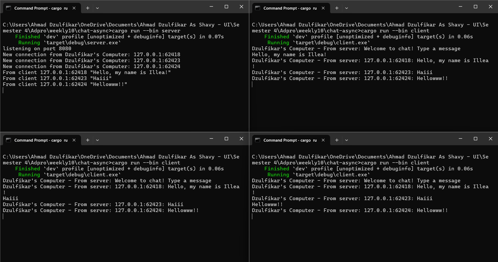

# Tutorial 10 - Broadcast

## 2.1. Original code of broadcast chat

Hasil tersebut saya dapatkan karena saya menjalankan 'cargo run server' pada suatu command prompt, lalu saya menjalankan 'cargo run client' pada ketiga CMD sisanya. Ketika kita menjalankan server, server akan listen kepada request yang masuk ke port 2000 dan setiap ada client yang connect ke server, maka server akan menampilkan 'New connection from 127.0.0.1:......'. Ketika salah satu client mengetik pesan pada terminal seperti yang saya lakukkan "This is from client 1" maka server akan ngeprint "From server: This is from client 1" dan pada client yang lain yang sudah terbuka akan ditampilkan "From server: This is from client 1" dan kemudian jika ada pesan dari suatu client, maka semua client yang connected juga akan mendapatkan pesan tersebut.

## 2.2: Modifying port

Untuk merubah port dari 2000 menjadi 8080, kita hanya perlu mengedit bagian port pada URL di file server.rs (bagian TcpListener) dan client.rs (bagian ClientBuilder). Pada kedua komponen tersebut, URL sudah memakai protokol WebSocket.

## 2.3: Small changes, add IP and port.

Untuk menyisipkan alamat IP dan port pada setiap pesan yang disebarkan, Anda perlu mengubah bagian handle_connection di file server.rs dengan menambahkan data addr ke dalam pesan yang dikirim lewat channel broadcast. Perubahan ini dilakukan tepat saat menerima pesan dari client sebelum memanggil bcast_tx.send(...).

Dengan cara ini, setiap pesan yang datang dari client akan mencantumkan identitas pengirimnya berupa IP dan port. Ketika pesan tersebut diteruskan ke semua client lain melalui bcast_rx.recv(), mereka dapat mengetahui asal pesan tersebut secara jelas.